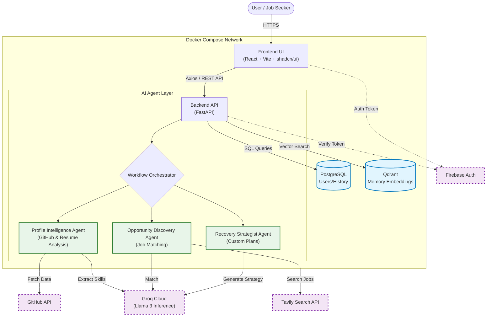

# Phoenix AI 🦅🔥
> **Rise from Rejection. Rebuild Your Career.**

 


## 🚀 Overview
**Phoenix AI** is an intelligent, agentic career recovery system designed to help job seekers bounce back from rejection. Unlike generic career coaches, Phoenix AI uses a **Multi-Agent System** to analyze your specific situation, diagnose the "silent killers" in your resume, and generate a personalized, step-by-step recovery roadmap.

It's not just advice; it's a **strategic campaign** to get you hired.

## ✨ Key Features
*   **🧠 Agentic Memory (RAG)**: Remembers your entire interaction history using **Qdrant** (Vector Hub) and **PostgreSQL**. It knows your skills, your past rejections, and your goals.
*   **🕵️‍♂️ Profile Intelligence Agent**: detailed analysis of your Resume (PDF) and GitHub profile to uncover hidden strengths and gaps.
*   **🎯 Opportunity Discovery Agent**: Matches your true capabilities with live market opportunities (via Tavily Search).
*   **🛡️ Recovery Strategist Agent**: The core of Phoenix. It takes a rejection email or context and generates a **custom diagnosis** and a **tactical recovery plan**.
*   **💬 Persistent Chat**: A context-aware chat interface that acts as your 24/7 career mentor.
*   **🐳 Fully Dockerized**: Deploy the entire stack (Frontend, Backend, DBs, LLM) with a single command.

## 🏗️ Architecture
The system is built on a robust, scalable architecture:



## 🛠️ Tech Stack
*   **Frontend**: React, Vite, TailwindCSS, shadcn/ui (Phoenix Theme 🟠)
*   **Backend**: Python, FastAPI
*   **AI/ML**: LangChain, LangGraph, Ollama/Groq (Llama 3)
*   **Database**: PostgreSQL (Relational), Qdrant (Vector)
*   **DevOps**: Docker, Nginx

## 🚀 Getting Started

### Prerequisites
*   Docker & Docker Desktop
*   Git

### Installation
1.  **Clone the repository**:
    ```bash
    git clone https://github.com/Sharukesh3/Phoenix-AI.git
    cd Phoenix-AI
    ```

2.  **Set up Environment**:
    Create a `.env` file in the root directory:
    ```env
    GROQ_API_KEY=your_key_here
    TAVILY_API_KEY=your_key_here
    GITHUB_TOKEN=your_key_here
    ```

3.  **Run with Docker**:
    ```bash
    docker-compose up --build
    ```
    *   **Frontend**: [http://localhost](http://localhost)
    *   **API Docs**: [http://localhost/docs](http://localhost/docs)

## 🤝 Contributing
Built with ❤️ for **Anokha 2026**.